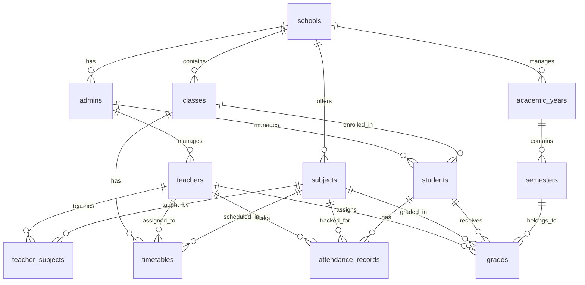

# School Management System - Database Schema Design

## Overview
This document outlines the complete database schema for the school management system with three user types: Admin, Teacher, and Student.

## Database Schema

### Core Tables

#### 1. Schools Table
```sql
CREATE TABLE schools (
    id UUID PRIMARY KEY DEFAULT gen_random_uuid(),
    name TEXT NOT NULL,
    address TEXT,
    phone TEXT,
    email TEXT,
    created_at TIMESTAMP WITH TIME ZONE DEFAULT NOW(),
    updated_at TIMESTAMP WITH TIME ZONE DEFAULT NOW()
);
```

#### 2. Admins Table
```sql
CREATE TABLE admins (
    id UUID PRIMARY KEY DEFAULT gen_random_uuid(),
    school_id UUID REFERENCES schools(id) ON DELETE CASCADE,
    name TEXT NOT NULL,
    email TEXT UNIQUE NOT NULL,
    admin_id TEXT UNIQUE NOT NULL,
    phone TEXT,
    permissions JSONB DEFAULT '{}',
    created_at TIMESTAMP WITH TIME ZONE DEFAULT NOW(),
    updated_at TIMESTAMP WITH TIME ZONE DEFAULT NOW()
);
```

#### 3. Teachers Table
```sql
CREATE TABLE teachers (
    id UUID PRIMARY KEY DEFAULT gen_random_uuid(),
    school_id UUID REFERENCES schools(id) ON DELETE CASCADE,
    name TEXT NOT NULL,
    email TEXT UNIQUE NOT NULL,
    teacher_id TEXT UNIQUE NOT NULL,
    phone TEXT,
    created_at TIMESTAMP WITH TIME ZONE DEFAULT NOW(),
    updated_at TIMESTAMP WITH TIME ZONE DEFAULT NOW()
);
```

#### 4. Classes Table
```sql
CREATE TABLE classes (
    id UUID PRIMARY KEY DEFAULT gen_random_uuid(),
    school_id UUID REFERENCES schools(id) ON DELETE CASCADE,
    name TEXT NOT NULL,
    grade_level TEXT,
    capacity INTEGER DEFAULT 30,
    created_at TIMESTAMP WITH TIME ZONE DEFAULT NOW(),
    updated_at TIMESTAMP WITH TIME ZONE DEFAULT NOW()
);
```

#### 5. Students Table
```sql
CREATE TABLE students (
    id UUID PRIMARY KEY DEFAULT gen_random_uuid(),
    school_id UUID REFERENCES schools(id) ON DELETE CASCADE,
    class_id UUID REFERENCES classes(id) ON DELETE SET NULL,
    name TEXT NOT NULL,
    email TEXT UNIQUE NOT NULL,
    student_id TEXT UNIQUE NOT NULL,
    parent_contact TEXT,
    created_at TIMESTAMP WITH TIME ZONE DEFAULT NOW(),
    updated_at TIMESTAMP WITH TIME ZONE DEFAULT NOW()
);
```

#### 6. Subjects Table
```sql
CREATE TABLE subjects (
    id UUID PRIMARY KEY DEFAULT gen_random_uuid(),
    school_id UUID REFERENCES schools(id) ON DELETE CASCADE,
    name TEXT NOT NULL,
    code TEXT NOT NULL,
    description TEXT,
    created_at TIMESTAMP WITH TIME ZONE DEFAULT NOW(),
    updated_at TIMESTAMP WITH TIME ZONE DEFAULT NOW(),
    UNIQUE(school_id, code)
);
```

#### 7. Teacher Subjects Junction Table
```sql
CREATE TABLE teacher_subjects (
    id UUID PRIMARY KEY DEFAULT gen_random_uuid(),
    teacher_id UUID REFERENCES teachers(id) ON DELETE CASCADE,
    subject_id UUID REFERENCES subjects(id) ON DELETE CASCADE,
    created_at TIMESTAMP WITH TIME ZONE DEFAULT NOW(),
    UNIQUE(teacher_id, subject_id)
);
```

#### 8. Academic Years Table
```sql
CREATE TABLE academic_years (
    id UUID PRIMARY KEY DEFAULT gen_random_uuid(),
    school_id UUID REFERENCES schools(id) ON DELETE CASCADE,
    name TEXT NOT NULL,
    start_date DATE NOT NULL,
    end_date DATE NOT NULL,
    is_current BOOLEAN DEFAULT FALSE,
    created_at TIMESTAMP WITH TIME ZONE DEFAULT NOW(),
    UNIQUE(school_id, name)
);
```

#### 9. Semesters Table
```sql
CREATE TABLE semesters (
    id UUID PRIMARY KEY DEFAULT gen_random_uuid(),
    academic_year_id UUID REFERENCES academic_years(id) ON DELETE CASCADE,
    name TEXT NOT NULL,
    semester_number INTEGER NOT NULL CHECK (semester_number IN (1, 2, 3)),
    start_date DATE NOT NULL,
    end_date DATE NOT NULL,
    is_current BOOLEAN DEFAULT FALSE,
    created_at TIMESTAMP WITH TIME ZONE DEFAULT NOW(),
    UNIQUE(academic_year_id, semester_number)
);
```

#### 10. Timetables Table
```sql
CREATE TABLE timetables (
    id UUID PRIMARY KEY DEFAULT gen_random_uuid(),
    school_id UUID REFERENCES schools(id) ON DELETE CASCADE,
    class_id UUID REFERENCES classes(id) ON DELETE CASCADE,
    subject_id UUID REFERENCES subjects(id) ON DELETE CASCADE,
    teacher_id UUID REFERENCES teachers(id) ON DELETE CASCADE,
    day_of_week TEXT NOT NULL CHECK (day_of_week IN ('monday', 'tuesday', 'wednesday', 'thursday', 'friday', 'saturday', 'sunday')),
    start_time TIME NOT NULL,
    end_time TIME NOT NULL,
    created_at TIMESTAMP WITH TIME ZONE DEFAULT NOW(),
    updated_at TIMESTAMP WITH TIME ZONE DEFAULT NOW(),
    UNIQUE(class_id, day_of_week, start_time)
);
```

#### 11. Attendance Records Table
```sql
CREATE TABLE attendance_records (
    id UUID PRIMARY KEY DEFAULT gen_random_uuid(),
    student_id UUID REFERENCES students(id) ON DELETE CASCADE,
    subject_id UUID REFERENCES subjects(id) ON DELETE CASCADE,
    teacher_id UUID REFERENCES teachers(id) ON DELETE CASCADE,
    attendance_date DATE NOT NULL,
    is_present BOOLEAN NOT NULL DEFAULT TRUE,
    notes TEXT,
    created_at TIMESTAMP WITH TIME ZONE DEFAULT NOW(),
    UNIQUE(student_id, subject_id, attendance_date)
);
```

#### 12. Grades Table
```sql
CREATE TABLE grades (
    id UUID PRIMARY KEY DEFAULT gen_random_uuid(),
    student_id UUID REFERENCES students(id) ON DELETE CASCADE,
    subject_id UUID REFERENCES subjects(id) ON DELETE CASCADE,
    teacher_id UUID REFERENCES teachers(id) ON DELETE CASCADE,
    semester_id UUID REFERENCES semesters(id) ON DELETE CASCADE,
    grade_number INTEGER NOT NULL CHECK (grade_number IN (1, 2)),
    grade_value DECIMAL(5,2) NOT NULL,
    max_grade DECIMAL(5,2) NOT NULL DEFAULT 100.00,
    notes TEXT,
    created_at TIMESTAMP WITH TIME ZONE DEFAULT NOW(),
    updated_at TIMESTAMP WITH TIME ZONE DEFAULT NOW(),
    UNIQUE(student_id, subject_id, semester_id, grade_number)
);
```

## Key Features

### 1. Multi-tenancy Support
- Each school is isolated with `school_id` foreign keys
- RLS policies will ensure data isolation between schools

### 2. User Management
- Three distinct user types: Admin, Teacher, Student
- Each with appropriate fields and relationships

### 3. Academic Structure
- Academic years with multiple semesters (3 as requested)
- Classes that can contain multiple students
- Subjects that can be taught by multiple teachers

### 4. Timetable System
- Weekly recurring schedule support
- Links classes, subjects, and teachers with specific time slots
- Day of week and time-based scheduling

### 5. Attendance Tracking
- Per-subject attendance as requested
- Daily tracking with teacher assignment
- Boolean present/absent with optional notes

### 6. Grading System
- Two grades per subject per semester (as requested)
- Supports decimal grades with maximum grade values
- Links to specific teacher, student, subject, and semester

## Entity Relationships



## Next Steps
1. Create database functions for common operations
2. Implement Row Level Security (RLS) policies
3. Set up authentication and user roles
4. Create initial data setup scripts