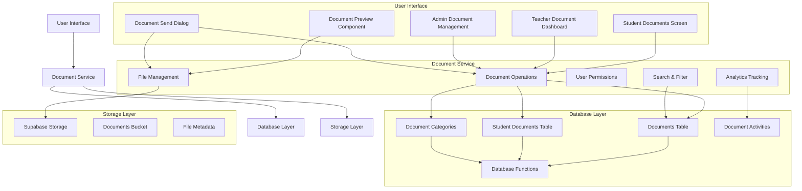

# Document Management System Architecture Diagram

This diagram shows the key components of the new document management system and their relationships:

1. **User Interface Layer**: Contains all the screens and components that users interact with
2. **Document Service Layer**: The core business logic for document management
3. **Database Layer**: All database tables and functions that store document metadata
4. **Storage Layer**: The file storage system where actual document files are stored

The arrows indicate the flow of data and interactions between components.