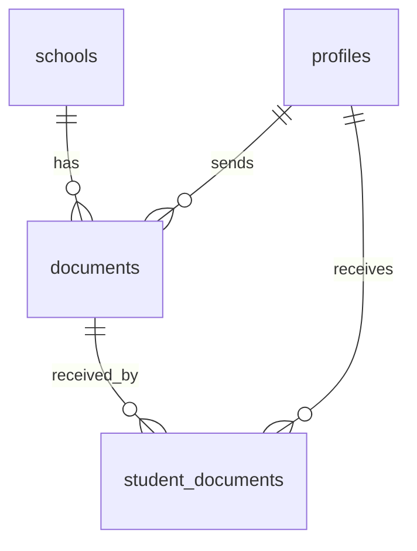

# Document Management Feature Design

## Overview
This document outlines the design for implementing PDF document sending functionality from admins and teachers to students in the Smart Safe School system.

## Requirements Analysis
- Admins and teachers should be able to send PDF documents to individual students or groups of students
- Students should be able to view and download received documents
- Documents should be stored securely with proper access controls
- The system should track who sent which document to which student and when

## Database Schema Design

### Documents Table
```sql
CREATE TABLE documents (
    id UUID PRIMARY KEY DEFAULT gen_random_uuid(),
    school_id UUID REFERENCES schools(id) ON DELETE CASCADE,
    sender_id UUID NOT NULL, -- References profiles.id of the sender (admin or teacher)
    sender_type TEXT NOT NULL CHECK (sender_type IN ('admin', 'teacher')),
    title TEXT NOT NULL,
    description TEXT,
    file_path TEXT NOT NULL, -- Path to the file in Supabase storage
    file_name TEXT NOT NULL, -- Original file name
    file_size INTEGER, -- Size in bytes
    mime_type TEXT DEFAULT 'application/pdf',
    created_at TIMESTAMP WITH TIME ZONE DEFAULT NOW(),
    updated_at TIMESTAMP WITH TIME ZONE DEFAULT NOW()
);
```

### Student Documents Junction Table
```sql
CREATE TABLE student_documents (
    id UUID PRIMARY KEY DEFAULT gen_random_uuid(),
    document_id UUID REFERENCES documents(id) ON DELETE CASCADE,
    student_id UUID REFERENCES students(id) ON DELETE CASCADE, -- References profiles.id
    is_read BOOLEAN DEFAULT FALSE,
    created_at TIMESTAMP WITH TIME ZONE DEFAULT NOW(),
    UNIQUE(document_id, student_id)
);
```

## Entity Relationships


## Model Structure
We'll need the following Dart models:
1. Document model - represents a document sent by an admin or teacher
2. StudentDocument model - represents the relationship between a document and a student

## Service Structure
We'll need a DocumentService to handle:
1. Uploading documents to Supabase storage
2. Creating document records in the database
3. Associating documents with students
4. Retrieving documents for students
5. Marking documents as read

## UI Components
1. Document upload screen for admins and teachers
2. Document list screen for students
3. Document detail screen for viewing/downloading documents

## Security Considerations
- Only admins and teachers can upload documents
- Only the intended recipients can view/download documents
- Row Level Security (RLS) policies will be implemented to enforce these restrictions