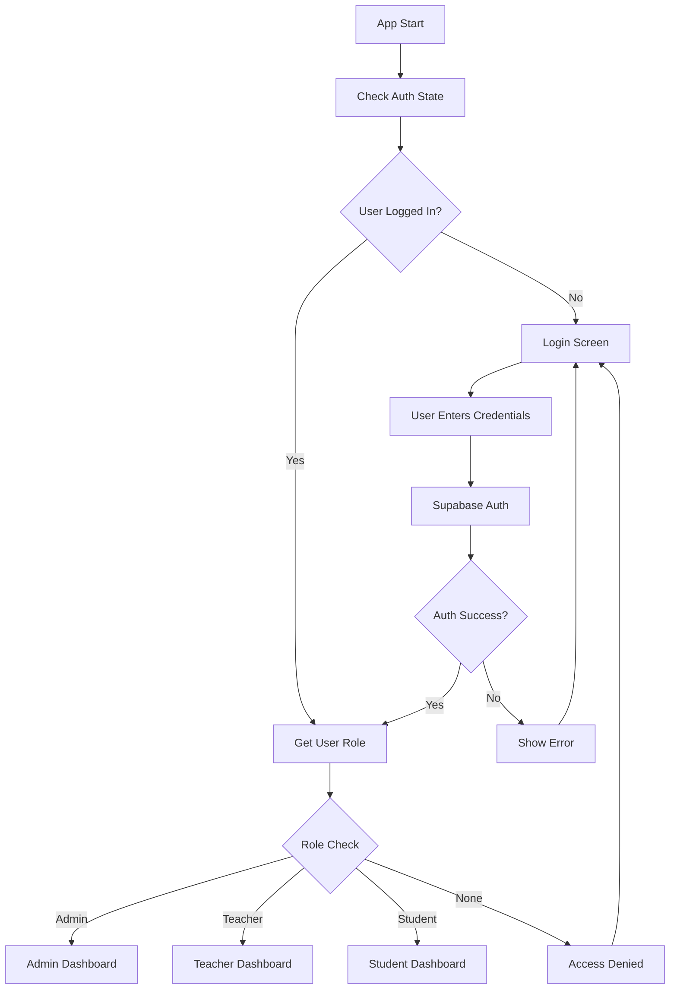

# Flutter Implementation Plan

## Project Structure

```
lib/
├── main.dart
├── app.dart
├── core/
│   ├── constants/
│   │   ├── app_constants.dart
│   │   └── supabase_constants.dart
│   ├── config/
│   │   └── supabase_config.dart
│   ├── utils/
│   │   ├── validators.dart
│   │   └── helpers.dart
│   └── theme/
│       └── app_theme.dart
├── models/
│   ├── school.dart
│   ├── admin.dart
│   ├── teacher.dart
│   ├── student.dart
│   ├── class.dart
│   ├── subject.dart
│   ├── timetable.dart
│   ├── attendance.dart
│   ├── grade.dart
│   ├── academic_year.dart
│   └── semester.dart
├── services/
│   ├── auth_service.dart
│   ├── supabase_service.dart
│   ├── admin_service.dart
│   ├── teacher_service.dart
│   ├── student_service.dart
│   ├── timetable_service.dart
│   ├── attendance_service.dart
│   └── grade_service.dart
├── screens/
│   ├── auth/
│   │   ├── login_screen.dart
│   │   └── role_selection_screen.dart
│   ├── admin/
│   │   ├── admin_dashboard.dart
│   │   ├── manage_students.dart
│   │   ├── manage_teachers.dart
│   │   ├── manage_classes.dart
│   │   ├── manage_subjects.dart
│   │   ├── manage_timetable.dart
│   │   └── reports_screen.dart
│   ├── teacher/
│   │   ├── teacher_dashboard.dart
│   │   ├── attendance_screen.dart
│   │   ├── grades_screen.dart
│   │   └── timetable_view.dart
│   └── student/
│       ├── student_dashboard.dart
│       ├── view_timetable.dart
│       ├── view_grades.dart
│       └── view_attendance.dart
├── widgets/
│   ├── common/
│   │   ├── custom_app_bar.dart
│   │   ├── loading_widget.dart
│   │   ├── error_widget.dart
│   │   └── custom_button.dart
│   ├── admin/
│   │   ├── student_card.dart
│   │   ├── teacher_card.dart
│   │   ├── class_card.dart
│   │   └── timetable_grid.dart
│   ├── teacher/
│   │   ├── attendance_list.dart
│   │   └── grade_input.dart
│   └── student/
│       ├── grade_card.dart
│       └── attendance_summary.dart
└── providers/
    ├── auth_provider.dart
    ├── admin_provider.dart
    ├── teacher_provider.dart
    └── student_provider.dart
```

## Required Dependencies

Add these to [`pubspec.yaml`](pubspec.yaml):

```yaml
dependencies:
  flutter:
    sdk: flutter
  cupertino_icons: ^1.0.8
  
  # Supabase
  supabase_flutter: ^2.3.4
  
  # State Management
  provider: ^6.1.1
  
  # UI Components
  flutter_form_builder: ^9.1.1
  form_builder_validators: ^9.1.0
  
  # Navigation
  go_router: ^12.1.3
  
  # Date/Time
  intl: ^0.19.0
  
  # Loading and Progress
  flutter_spinkit: ^5.2.0
  
  # Icons
  flutter_svg: ^2.0.9
  
  # Charts for reports
  fl_chart: ^0.66.0
  
  # File handling
  file_picker: ^6.1.1
  
  # Utilities
  uuid: ^4.2.1
  shared_preferences: ^2.2.2

dev_dependencies:
  flutter_test:
    sdk: flutter
  flutter_lints: ^5.0.0
  build_runner: ^2.4.7
```

## Data Models

### Base Model
```dart
abstract class BaseModel {
  final String id;
  final DateTime createdAt;
  final DateTime? updatedAt;

  BaseModel({
    required this.id,
    required this.createdAt,
    this.updatedAt,
  });

  Map<String, dynamic> toJson();
  
  @override
  bool operator ==(Object other) =>
      identical(this, other) ||
      other is BaseModel && runtimeType == other.runtimeType && id == other.id;

  @override
  int get hashCode => id.hashCode;
}
```

### School Model
```dart
class School extends BaseModel {
  final String name;
  final String? address;
  final String? phone;
  final String? email;

  School({
    required super.id,
    required super.createdAt,
    super.updatedAt,
    required this.name,
    this.address,
    this.phone,
    this.email,
  });

  factory School.fromJson(Map<String, dynamic> json) {
    return School(
      id: json['id'],
      createdAt: DateTime.parse(json['created_at']),
      updatedAt: json['updated_at'] != null 
          ? DateTime.parse(json['updated_at']) 
          : null,
      name: json['name'],
      address: json['address'],
      phone: json['phone'],
      email: json['email'],
    );
  }

  @override
  Map<String, dynamic> toJson() {
    return {
      'id': id,
      'name': name,
      'address': address,
      'phone': phone,
      'email': email,
      'created_at': createdAt.toIso8601String(),
      'updated_at': updatedAt?.toIso8601String(),
    };
  }
}
```

### User Models (Admin, Teacher, Student)
```dart
abstract class User extends BaseModel {
  final String schoolId;
  final String name;
  final String email;
  final String? phone;

  User({
    required super.id,
    required super.createdAt,
    super.updatedAt,
    required this.schoolId,
    required this.name,
    required this.email,
    this.phone,
  });
}

class Admin extends User {
  final String adminId;
  final Map<String, dynamic> permissions;

  Admin({
    required super.id,
    required super.createdAt,
    super.updatedAt,
    required super.schoolId,
    required super.name,
    required super.email,
    super.phone,
    required this.adminId,
    this.permissions = const {},
  });

  factory Admin.fromJson(Map<String, dynamic> json) {
    return Admin(
      id: json['id'],
      createdAt: DateTime.parse(json['created_at']),
      updatedAt: json['updated_at'] != null 
          ? DateTime.parse(json['updated_at']) 
          : null,
      schoolId: json['school_id'],
      name: json['name'],
      email: json['email'],
      phone: json['phone'],
      adminId: json['admin_id'],
      permissions: json['permissions'] ?? {},
    );
  }

  @override
  Map<String, dynamic> toJson() {
    return {
      'id': id,
      'school_id': schoolId,
      'name': name,
      'email': email,
      'phone': phone,
      'admin_id': adminId,
      'permissions': permissions,
      'created_at': createdAt.toIso8601String(),
      'updated_at': updatedAt?.toIso8601String(),
    };
  }
}

class Teacher extends User {
  final String teacherId;
  final List<String> subjectIds;

  Teacher({
    required super.id,
    required super.createdAt,
    super.updatedAt,
    required super.schoolId,
    required super.name,
    required super.email,
    super.phone,
    required this.teacherId,
    this.subjectIds = const [],
  });

  factory Teacher.fromJson(Map<String, dynamic> json) {
    return Teacher(
      id: json['id'],
      createdAt: DateTime.parse(json['created_at']),
      updatedAt: json['updated_at'] != null 
          ? DateTime.parse(json['updated_at']) 
          : null,
      schoolId: json['school_id'],
      name: json['name'],
      email: json['email'],
      phone: json['phone'],
      teacherId: json['teacher_id'],
      subjectIds: json['subject_ids'] != null 
          ? List<String>.from(json['subject_ids']) 
          : [],
    );
  }

  @override
  Map<String, dynamic> toJson() {
    return {
      'id': id,
      'school_id': schoolId,
      'name': name,
      'email': email,
      'phone': phone,
      'teacher_id': teacherId,
      'created_at': createdAt.toIso8601String(),
      'updated_at': updatedAt?.toIso8601String(),
    };
  }
}

class Student extends User {
  final String? classId;
  final String studentId;
  final String? parentContact;

  Student({
    required super.id,
    required super.createdAt,
    super.updatedAt,
    required super.schoolId,
    required super.name,
    required super.email,
    super.phone,
    this.classId,
    required this.studentId,
    this.parentContact,
  });

  factory Student.fromJson(Map<String, dynamic> json) {
    return Student(
      id: json['id'],
      createdAt: DateTime.parse(json['created_at']),
      updatedAt: json['updated_at'] != null 
          ? DateTime.parse(json['updated_at']) 
          : null,
      schoolId: json['school_id'],
      name: json['name'],
      email: json['email'],
      phone: json['phone'],
      classId: json['class_id'],
      studentId: json['student_id'],
      parentContact: json['parent_contact'],
    );
  }

  @override
  Map<String, dynamic> toJson() {
    return {
      'id': id,
      'school_id': schoolId,
      'name': name,
      'email': email,
      'phone': phone,
      'class_id': classId,
      'student_id': studentId,
      'parent_contact': parentContact,
      'created_at': createdAt.toIso8601String(),
      'updated_at': updatedAt?.toIso8601String(),
    };
  }
}
```

## Admin UI Wireframe Structure

### 1. Admin Dashboard Layout
```
┌─────────────────────────────────────────────────────────┐
│ Smart Safe School - Admin Dashboard            [Logout] │
├─────────────────────────────────────────────────────────┤
│                                                         │
│  ┌─────────────┐  ┌─────────────┐  ┌─────────────┐     │
│  │   Students  │  │  Teachers   │  │   Classes   │     │
│  │     150     │  │     25      │  │     12      │     │
│  └─────────────┘  └─────────────┘  └─────────────┘     │
│                                                         │
│  ┌─────────────┐  ┌─────────────┐  ┌─────────────┐     │
│  │  Subjects   │  │ Attendance  │  │   Grades    │     │
│  │     18      │  │    95%      │  │   Average   │     │
│  └─────────────┘  └─────────────┘  └─────────────┘     │
│                                                         │
│  Quick Actions:                                         │
│  [Add Student] [Add Teacher] [Create Class]             │
│  [Manage Timetable] [View Reports]                      │
│                                                         │
│  Recent Activities:                                     │
│  • New student John Doe added to Class 10A             │
│  • Timetable updated for Class 9B                      │
│  • Teacher Mary Smith assigned to Mathematics          │
│                                                         │
└─────────────────────────────────────────────────────────┘
```

### 2. Navigation Structure
```
Admin Dashboard
├── Students Management
│   ├── View All Students
│   ├── Add New Student
│   ├── Edit Student
│   └── Student Reports
├── Teachers Management
│   ├── View All Teachers
│   ├── Add New Teacher
│   ├── Edit Teacher
│   └── Assign Subjects
├── Classes Management
│   ├── View All Classes
│   ├── Create New Class
│   ├── Edit Class
│   └── Manage Enrollment
├── Subjects Management
│   ├── View All Subjects
│   ├── Add New Subject
│   └── Edit Subject
├── Timetable Management
│   ├── View Timetables
│   ├── Create Timetable
│   └── Edit Timetable
└── Reports & Analytics
    ├── Attendance Reports
    ├── Grade Reports
    ├── Teacher Performance
    └── School Statistics
```

### 3. Student Management Interface
```
┌─────────────────────────────────────────────────────────┐
│ Students Management                          [+ Add New] │
├─────────────────────────────────────────────────────────┤
│ Search: [________________] Filter: [Class ▼] [Sort ▼]   │
├─────────────────────────────────────────────────────────┤
│                                                         │
│ ┌─────────────────────────────────────────────────────┐ │
│ │ John Doe                    Class: 10A    [Edit]    │ │
│ │ ID: STU001                  Email: john@email.com   │ │
│ │ Parent: Jane Doe            Phone: +1234567890      │ │
│ └─────────────────────────────────────────────────────┘ │
│                                                         │
│ ┌─────────────────────────────────────────────────────┐ │
│ │ Mary Smith                  Class: 9B     [Edit]    │ │
│ │ ID: STU002                  Email: mary@email.com   │ │
│ │ Parent: Bob Smith           Phone: +1234567891      │ │
│ └─────────────────────────────────────────────────────┘ │
│                                                         │
│ [Previous] Page 1 of 15 [Next]                         │
└─────────────────────────────────────────────────────────┘
```

## Authentication Flow



## Service Layer Architecture

### Base Service
```dart
abstract class BaseService {
  final SupabaseClient supabase;
  
  BaseService(this.supabase);
  
  Future<T> handleRequest<T>(Future<T> Function() request) async {
    try {
      return await request();
    } on PostgrestException catch (e) {
      throw ServiceException('Database error: ${e.message}');
    } on AuthException catch (e) {
      throw ServiceException('Authentication error: ${e.message}');
    } catch (e) {
      throw ServiceException('Unexpected error: $e');
    }
  }
}

class ServiceException implements Exception {
  final String message;
  ServiceException(this.message);
  
  @override
  String toString() => message;
}
```

### Admin Service Example
```dart
class AdminService extends BaseService {
  AdminService(super.supabase);

  Future<List<Student>> getStudents({
    String? classId,
    String? searchQuery,
    int? limit,
    int? offset,
  }) async {
    return handleRequest(() async {
      var query = supabase
          .from('students')
          .select('*, classes(name)')
          .order('name');

      if (classId != null) {
        query = query.eq('class_id', classId);
      }

      if (searchQuery != null && searchQuery.isNotEmpty) {
        query = query.or('name.ilike.%$searchQuery%,student_id.ilike.%$searchQuery%');
      }

      if (limit != null) {
        query = query.limit(limit);
      }

      if (offset != null) {
        query = query.range(offset, offset + (limit ?? 10) - 1);
      }

      final response = await query;
      return response.map((json) => Student.fromJson(json)).toList();
    });
  }

  Future<Student> createStudent(Student student) async {
    return handleRequest(() async {
      final response = await supabase.rpc('create_student', params: {
        'p_school_id': student.schoolId,
        'p_class_id': student.classId,
        'p_name': student.name,
        'p_email': student.email,
        'p_student_id': student.studentId,
        'p_parent_contact': student.parentContact,
      });

      final studentData = await supabase
          .from('students')
          .select()
          .eq('id', response)
          .single();

      return Student.fromJson(studentData);
    });
  }

  Future<void> updateStudent(Student student) async {
    return handleRequest(() async {
      await supabase
          .from('students')
          .update(student.toJson())
          .eq('id', student.id);
    });
  }

  Future<void> deleteStudent(String studentId) async {
    return handleRequest(() async {
      await supabase
          .from('students')
          .delete()
          .eq('id', studentId);
    });
  }
}
```

## State Management with Provider

### Auth Provider
```dart
class AuthProvider extends ChangeNotifier {
  final AuthService _authService;
  
  User? _currentUser;
  String? _userRole;
  bool _isLoading = false;
  String? _error;

  AuthProvider(this._authService);

  User? get currentUser => _currentUser;
  String? get userRole => _userRole;
  bool get isLoading => _isLoading;
  String? get error => _error;
  bool get isAuthenticated => _currentUser != null;

  Future<void> signIn(String email, String password) async {
    _setLoading(true);
    try {
      final authResponse = await _authService.signIn(email, password);
      _currentUser = authResponse.user;
      _userRole = await _authService.getUserRole();
      _error = null;
    } catch (e) {
      _error = e.toString();
    } finally {
      _setLoading(false);
    }
  }

  Future<void> signOut() async {
    await _authService.signOut();
    _currentUser = null;
    _userRole = null;
    _error = null;
    notifyListeners();
  }

  void _setLoading(bool loading) {
    _isLoading = loading;
    notifyListeners();
  }
}
```

## Next Steps for Implementation

1. **Setup Supabase Configuration**
   - Add environment variables
   - Configure Supabase client
   - Set up authentication

2. **Implement Core Services**
   - Authentication service
   - Base service with error handling
   - Admin service for CRUD operations

3. **Create UI Components**
   - Common widgets (buttons, forms, cards)
   - Admin-specific components
   - Navigation structure

4. **Build Admin Dashboard**
   - Dashboard with statistics
   - Student management interface
   - Teacher management interface
   - Class and subject management

5. **Add Advanced Features**
   - Timetable creation interface
   - Reports and analytics
   - Data export functionality

This plan provides a solid foundation for building the Flutter admin interface with proper architecture, state management, and integration with your Supabase backend.