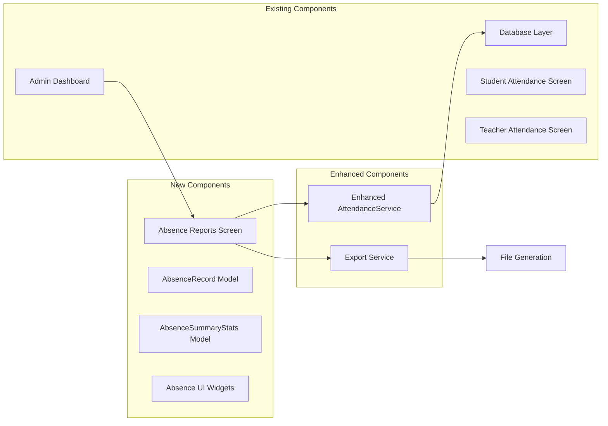

# Absence Reports Implementation Summary

## Project Overview

This document provides a comprehensive summary of the absence-focused attendance reporting system designed for the Smart Safe School application. The system extends existing attendance functionality to provide administrators with detailed insights into student absences while maintaining current screens for students and teachers.

## Key Requirements Met

✅ **Admin-only absence reports** with custom date range filtering  
✅ **Focus on absences only** (where `is_present = false`)  
✅ **Preserve existing attendance screens** for students and teachers  
✅ **Advanced filtering and search** capabilities  
✅ **Export functionality** for absence data  
✅ **Comprehensive system architecture** and testing strategy  

## Architecture Summary

### System Components



### Key Features

1. **Date Range Selection**: Custom date picker with quick filter options
2. **Summary Statistics**: Total absences, affected students, absence rates
3. **Advanced Filtering**: By class, subject, student name with real-time search
4. **Export Options**: CSV and PDF export with configurable data fields
5. **Performance Optimization**: Indexed queries, caching, and pagination
6. **Security**: Role-based access control and data privacy compliance

## Implementation Deliverables

### 1. Technical Documentation
- [x] **Implementation Plan** (`attendance_absence_reports_implementation_plan.md`)
- [x] **System Architecture** (`absence_reports_system_architecture.md`)
- [x] **Testing & Roadmap** (`absence_reports_testing_implementation_roadmap.md`)
- [x] **Implementation Summary** (this document)

### 2. Database Enhancements
```sql
-- Key database functions and indexes
CREATE INDEX idx_attendance_records_absence_date 
ON attendance_records(is_present, attendance_date) 
WHERE is_present = false;

CREATE OR REPLACE FUNCTION get_absence_records(
  p_start_date DATE,
  p_end_date DATE,
  p_class_id UUID DEFAULT NULL,
  p_subject_id UUID DEFAULT NULL,
  p_search_query TEXT DEFAULT NULL
) RETURNS TABLE (...);
```

### 3. Data Models
```dart
// New models for absence reporting
class AbsenceRecord extends BaseModel { ... }
class AbsenceSummaryStats { ... }
class ClassAbsenceStats { ... }
class StudentAbsenceStats { ... }
class AbsenceTrendData { ... }
```

### 4. Enhanced Services
```dart
// Extended AttendanceService with absence-focused methods
class AttendanceService {
  Future<List<AbsenceRecord>> getAbsenceRecords({...});
  Future<AbsenceSummaryStats> getAbsenceSummary({...});
  Future<List<ClassAbsenceStats>> getAbsenceStatsByClass({...});
  Future<List<StudentAbsenceStats>> getStudentsWithHighAbsences({...});
  Future<List<AbsenceTrendData>> getAbsenceTrends({...});
}
```

### 5. UI Components
```dart
// New UI components for absence reporting
class AbsenceReportsScreen extends StatefulWidget { ... }
class AbsenceSummaryCard extends StatelessWidget { ... }
class AbsenceRecordCard extends StatelessWidget { ... }
class DateRangePicker extends StatefulWidget { ... }
class AbsenceFilters extends StatefulWidget { ... }
```

## Implementation Phases

### Phase 1: Foundation (Week 1-2)
- Database setup and optimization
- Data models implementation
- Enhanced AttendanceService methods
- Unit testing for core functionality

### Phase 2: UI Development (Week 3-4)
- Core UI components creation
- Main absence reports screen
- Navigation integration
- Widget testing

### Phase 3: Advanced Features (Week 5-6)
- Export functionality implementation
- Analytics and insights
- Performance optimization
- Integration testing

### Phase 4: Security & Testing (Week 7-8)
- Security implementation
- Comprehensive testing
- Performance testing
- User acceptance testing

## File Structure

```
lib/
├── models/
│   ├── absence_record.dart                    [NEW]
│   ├── absence_summary_stats.dart             [NEW]
│   ├── class_absence_stats.dart               [NEW]
│   └── student_absence_stats.dart             [NEW]
├── services/
│   ├── attendance_service.dart                [ENHANCED]
│   └── export_service.dart                    [NEW]
├── screens/
│   └── admin/
│       ├── absence_reports_screen.dart        [NEW]
│       └── admin_dashboard.dart               [ENHANCED]
├── widgets/
│   ├── absence_summary_card.dart              [NEW]
│   ├── absence_record_card.dart               [NEW]
│   ├── date_range_picker.dart                 [NEW]
│   └── absence_filters.dart                   [NEW]
└── test/
    ├── unit/
    │   ├── models/                            [NEW]
    │   └── services/                          [NEW]
    ├── integration/                           [NEW]
    └── widget/                                [NEW]
```

## Database Migration Requirements

### Required Indexes
```sql
-- Performance optimization indexes
CREATE INDEX IF NOT EXISTS idx_attendance_records_absence_date 
ON attendance_records(is_present, attendance_date) 
WHERE is_present = false;

CREATE INDEX IF NOT EXISTS idx_attendance_records_student_absence 
ON attendance_records(student_id, is_present, attendance_date) 
WHERE is_present = false;

CREATE INDEX IF NOT EXISTS idx_students_class_id ON students(class_id);
CREATE INDEX IF NOT EXISTS idx_students_name ON students(name);
```

### Database Functions
```sql
-- Optimized query functions
CREATE OR REPLACE FUNCTION get_absence_records(...) RETURNS TABLE (...);
CREATE OR REPLACE FUNCTION get_absence_summary(...) RETURNS TABLE (...);
CREATE OR REPLACE FUNCTION get_absence_stats_by_class(...) RETURNS TABLE (...);
```

## Security Considerations

### Access Control Matrix
| User Role | View Own Attendance | View Class Absences | View All Absences | Export Reports |
|-----------|-------------------|-------------------|------------------|----------------|
| Student   | ✅                | ❌                | ❌               | ❌             |
| Teacher   | ✅                | ✅ (Own Classes)  | ❌               | ❌             |
| Admin     | ✅                | ✅                | ✅               | ✅             |

### Security Implementation
- Role-based access control validation
- Data privacy compliance (GDPR/COPPA)
- Audit logging for report access
- Rate limiting for export operations
- SQL injection prevention

## Performance Targets

### Response Time Goals
- Report generation: < 3 seconds for 1000 records
- Export functionality: < 10 seconds for monthly reports
- UI responsiveness: < 500ms for filter operations
- Database queries: < 1 second for complex joins

### Scalability Considerations
- Database query optimization with proper indexing
- Caching layer for frequently accessed data
- Pagination for large datasets
- Background processing for exports

## Testing Strategy Summary

### Test Coverage Goals
- **Unit Tests**: 90%+ coverage for models and services
- **Widget Tests**: All UI components tested
- **Integration Tests**: Complete workflow testing
- **Performance Tests**: Load testing with large datasets
- **Security Tests**: Access control and data privacy validation

### Test Types
1. **Unit Testing**: Models, services, and utility functions
2. **Widget Testing**: UI components and screens
3. **Integration Testing**: End-to-end workflows
4. **Performance Testing**: Load and memory usage
5. **Security Testing**: Access control and data protection

## Success Metrics

### Functional Metrics
- ✅ Admin can generate absence reports with custom date ranges
- ✅ Filtering and search work across all data fields
- ✅ Export functionality produces accurate CSV/PDF files
- ✅ Summary statistics calculate correctly
- ✅ System maintains existing attendance functionality

### Performance Metrics
- Report generation time < 3 seconds
- Export completion time < 10 seconds
- UI response time < 500ms
- Database query time < 1 second
- Memory usage remains stable

### User Experience Metrics
- Intuitive navigation and filtering
- Clear visual representation of data
- Efficient workflow for report generation
- Reliable export functionality
- Responsive design across devices

## Next Steps for Implementation

### Immediate Actions (Week 1)
1. **Set up development environment** with test database
2. **Create database migration scripts** for indexes and functions
3. **Implement core data models** with comprehensive testing
4. **Begin AttendanceService enhancements** with absence methods

### Short-term Goals (Week 2-4)
1. **Complete service layer implementation** with error handling
2. **Develop UI components** with responsive design
3. **Implement main absence reports screen** with filtering
4. **Add navigation integration** to admin dashboard

### Medium-term Goals (Week 5-8)
1. **Implement export functionality** with multiple formats
2. **Add analytics and trend analysis** features
3. **Complete comprehensive testing** suite
4. **Perform security and performance optimization**

## Risk Mitigation

### Technical Risks
- **Database Performance**: Mitigated by proper indexing and query optimization
- **Large Dataset Handling**: Addressed through pagination and caching
- **Export File Size**: Managed with configurable limits and compression

### Security Risks
- **Unauthorized Access**: Prevented by role-based access control
- **Data Privacy**: Ensured through compliance measures and audit logging
- **SQL Injection**: Prevented by parameterized queries and input validation

### User Experience Risks
- **Complex UI**: Mitigated by intuitive design and user testing
- **Slow Performance**: Addressed through optimization and caching
- **Export Failures**: Handled with proper error handling and retry mechanisms

## Conclusion

The absence reports implementation provides a comprehensive solution for administrators to track and analyze student absences while maintaining the existing attendance functionality for students and teachers. The system is designed with scalability, security, and performance in mind, ensuring it can handle the needs of schools of various sizes.

The detailed architecture, implementation plan, and testing strategy provide a clear roadmap for development teams to successfully implement this feature. The modular design allows for incremental development and future enhancements while maintaining code quality and system reliability.

## Ready for Implementation

This planning phase is now complete with:
- ✅ Comprehensive technical specifications
- ✅ Detailed system architecture
- ✅ Complete implementation roadmap
- ✅ Thorough testing strategy
- ✅ Security and performance considerations
- ✅ Clear success metrics and risk mitigation

The development team can now proceed with confidence to implement the absence reporting system using the provided documentation as a guide.