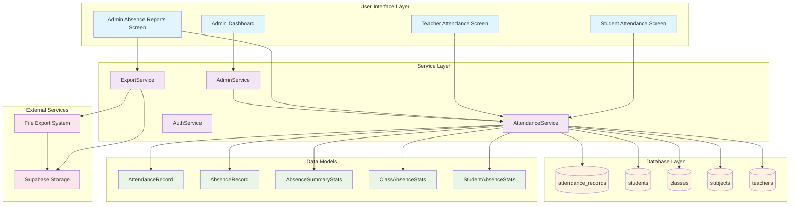
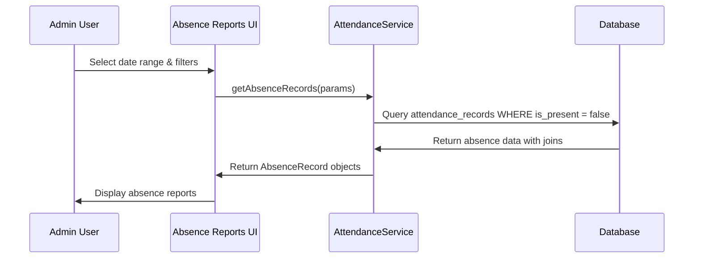
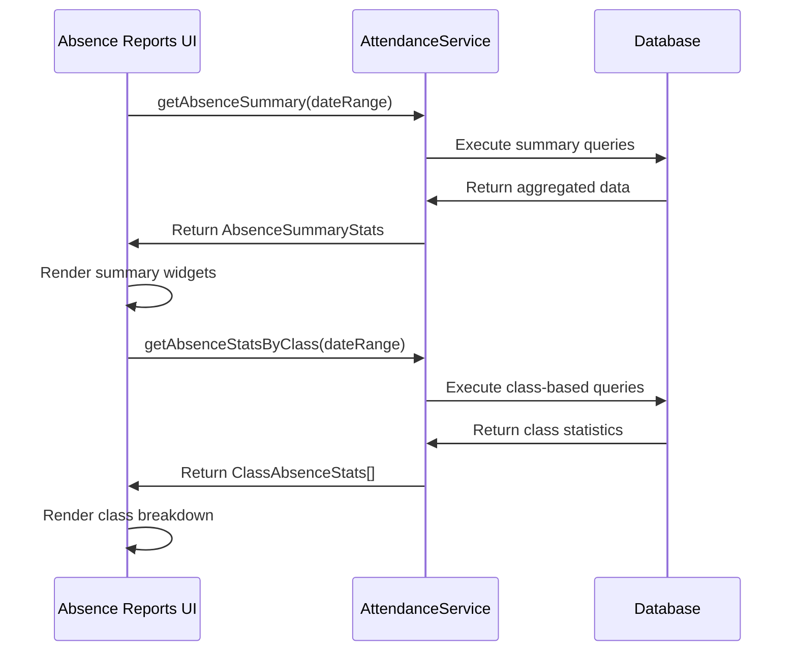
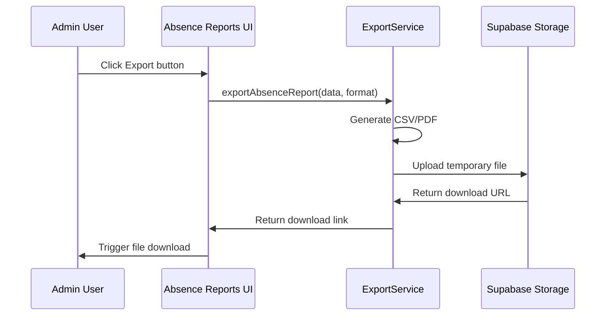

# Absence Reports System Architecture

## System Overview

The absence reporting system extends the existing attendance functionality to provide administrators with focused insights into student absences. This document outlines the complete system architecture and data flow.

## Architecture Diagram



## Data Flow Architecture

### 1. Absence Data Retrieval Flow



### 2. Statistics Generation Flow



### 3. Export Functionality Flow



## Component Architecture

### Enhanced AttendanceService Structure

```dart
class AttendanceService {
  // Existing methods (unchanged)
  Future<void> saveAttendanceRecords(List<AttendanceRecord> records);
  Future<List<AttendanceRecord>> loadAttendanceRecords({...});
  Future<void> updateAttendanceRecord(AttendanceRecord record);
  Future<void> deleteAttendanceRecord(String recordId);
  Future<bool> doesAttendanceExist({...});

  // New absence-focused methods
  Future<List<AbsenceRecord>> getAbsenceRecords({
    required DateTime startDate,
    required DateTime endDate,
    String? classId,
    String? subjectId,
    String? studentId,
    String? searchQuery,
  });

  Future<AbsenceSummaryStats> getAbsenceSummary({
    required DateTime startDate,
    required DateTime endDate,
  });

  Future<List<ClassAbsenceStats>> getAbsenceStatsByClass({
    required DateTime startDate,
    required DateTime endDate,
  });

  Future<List<StudentAbsenceStats>> getStudentsWithHighAbsences({
    required DateTime startDate,
    required DateTime endDate,
    int limit = 10,
  });

  Future<List<AbsenceTrendData>> getAbsenceTrends({
    required DateTime startDate,
    required DateTime endDate,
    String groupBy = 'day', // day, week, month
  });

  Future<Map<String, dynamic>> getAbsenceAnalytics({
    required DateTime startDate,
    required DateTime endDate,
  });
}
```

### New Data Models Structure

```dart
// Core absence record model
class AbsenceRecord extends BaseModel {
  final String studentId;
  final String studentName;
  final String studentNumber;
  final String classId;
  final String className;
  final String subjectId;
  final String subjectName;
  final String teacherId;
  final String teacherName;
  final DateTime absenceDate;
  final String? notes;
  final String? reason;
}

// Summary statistics model
class AbsenceSummaryStats {
  final int totalAbsences;
  final int uniqueStudentsAbsent;
  final int daysWithAbsences;
  final double averageAbsencesPerDay;
  final double absenceRate;
  final String mostAbsentClass;
  final String mostAbsentSubject;
  final List<String> topAbsentStudents;
  final Map<String, int> absencesByReason;
}

// Class-specific absence statistics
class ClassAbsenceStats {
  final String classId;
  final String className;
  final int totalStudents;
  final int studentsWithAbsences;
  final int totalAbsences;
  final double absenceRate;
  final double averageAbsencesPerStudent;
  final List<SubjectAbsenceStats> subjectBreakdown;
}

// Student-specific absence statistics
class StudentAbsenceStats {
  final String studentId;
  final String studentName;
  final String studentNumber;
  final String className;
  final int totalAbsences;
  final double absenceRate;
  final List<DateTime> absenceDates;
  final Map<String, int> absencesBySubject;
  final String? mostAbsentSubject;
}

// Trend analysis data
class AbsenceTrendData {
  final DateTime date;
  final int absenceCount;
  final int uniqueStudentsAbsent;
  final double absenceRate;
  final Map<String, int> absencesByClass;
}
```

## Database Query Optimization

### Optimized Queries for Absence Reports

```sql
-- 1. Main absence records query with all joins
CREATE OR REPLACE FUNCTION get_absence_records(
  p_start_date DATE,
  p_end_date DATE,
  p_class_id UUID DEFAULT NULL,
  p_subject_id UUID DEFAULT NULL,
  p_student_id UUID DEFAULT NULL,
  p_search_query TEXT DEFAULT NULL
) RETURNS TABLE (
  id UUID,
  student_id UUID,
  student_name TEXT,
  student_number TEXT,
  class_id UUID,
  class_name TEXT,
  subject_id UUID,
  subject_name TEXT,
  teacher_id UUID,
  teacher_name TEXT,
  absence_date DATE,
  notes TEXT
) AS $$
BEGIN
  RETURN QUERY
  SELECT 
    ar.id,
    ar.student_id,
    s.name as student_name,
    s.student_id as student_number,
    c.id as class_id,
    c.name as class_name,
    sub.id as subject_id,
    sub.name as subject_name,
    t.id as teacher_id,
    t.name as teacher_name,
    ar.attendance_date as absence_date,
    ar.notes
  FROM attendance_records ar
  JOIN students s ON ar.student_id = s.id
  JOIN classes c ON s.class_id = c.id
  JOIN subjects sub ON ar.subject_id = sub.id
  JOIN teachers t ON ar.teacher_id = t.id
  WHERE ar.is_present = false
    AND ar.attendance_date BETWEEN p_start_date AND p_end_date
    AND (p_class_id IS NULL OR c.id = p_class_id)
    AND (p_subject_id IS NULL OR sub.id = p_subject_id)
    AND (p_student_id IS NULL OR s.id = p_student_id)
    AND (p_search_query IS NULL OR 
         s.name ILIKE '%' || p_search_query || '%' OR
         s.student_id ILIKE '%' || p_search_query || '%' OR
         c.name ILIKE '%' || p_search_query || '%' OR
         sub.name ILIKE '%' || p_search_query || '%')
  ORDER BY ar.attendance_date DESC, s.name;
END;
$$ LANGUAGE plpgsql;

-- 2. Absence summary statistics
CREATE OR REPLACE FUNCTION get_absence_summary(
  p_start_date DATE,
  p_end_date DATE
) RETURNS TABLE (
  total_absences BIGINT,
  unique_students_absent BIGINT,
  days_with_absences BIGINT,
  average_absences_per_day NUMERIC,
  most_absent_class TEXT,
  most_absent_subject TEXT
) AS $$
BEGIN
  RETURN QUERY
  WITH absence_stats AS (
    SELECT 
      COUNT(*) as total_absences,
      COUNT(DISTINCT ar.student_id) as unique_students_absent,
      COUNT(DISTINCT ar.attendance_date) as days_with_absences
    FROM attendance_records ar
    WHERE ar.is_present = false
      AND ar.attendance_date BETWEEN p_start_date AND p_end_date
  ),
  class_absences AS (
    SELECT c.name, COUNT(*) as absence_count
    FROM attendance_records ar
    JOIN students s ON ar.student_id = s.id
    JOIN classes c ON s.class_id = c.id
    WHERE ar.is_present = false
      AND ar.attendance_date BETWEEN p_start_date AND p_end_date
    GROUP BY c.id, c.name
    ORDER BY absence_count DESC
    LIMIT 1
  ),
  subject_absences AS (
    SELECT sub.name, COUNT(*) as absence_count
    FROM attendance_records ar
    JOIN subjects sub ON ar.subject_id = sub.id
    WHERE ar.is_present = false
      AND ar.attendance_date BETWEEN p_start_date AND p_end_date
    GROUP BY sub.id, sub.name
    ORDER BY absence_count DESC
    LIMIT 1
  )
  SELECT 
    abs.total_absences,
    abs.unique_students_absent,
    abs.days_with_absences,
    CASE 
      WHEN abs.days_with_absences > 0 
      THEN abs.total_absences::NUMERIC / abs.days_with_absences::NUMERIC
      ELSE 0
    END as average_absences_per_day,
    ca.name as most_absent_class,
    sa.name as most_absent_subject
  FROM absence_stats abs
  CROSS JOIN class_absences ca
  CROSS JOIN subject_absences sa;
END;
$$ LANGUAGE plpgsql;
```

### Required Database Indexes

```sql
-- Optimize absence queries
CREATE INDEX IF NOT EXISTS idx_attendance_records_absence_date 
ON attendance_records(is_present, attendance_date) 
WHERE is_present = false;

CREATE INDEX IF NOT EXISTS idx_attendance_records_student_absence 
ON attendance_records(student_id, is_present, attendance_date) 
WHERE is_present = false;

CREATE INDEX IF NOT EXISTS idx_attendance_records_subject_absence 
ON attendance_records(subject_id, is_present, attendance_date) 
WHERE is_present = false;

-- Optimize joins for absence reports
CREATE INDEX IF NOT EXISTS idx_students_class_id ON students(class_id);
CREATE INDEX IF NOT EXISTS idx_students_name ON students(name);
CREATE INDEX IF NOT EXISTS idx_classes_name ON classes(name);
CREATE INDEX IF NOT EXISTS idx_subjects_name ON subjects(name);
CREATE INDEX IF NOT EXISTS idx_teachers_name ON teachers(name);
```

## Security Architecture

### Access Control Matrix

| User Role | View Own Attendance | Mark Attendance | View Class Absences | View All Absences | Export Reports |
|-----------|-------------------|-----------------|-------------------|------------------|----------------|
| Student   | ✅                | ❌              | ❌                | ❌               | ❌             |
| Teacher   | ✅                | ✅              | ✅ (Own Classes)  | ❌               | ❌             |
| Admin     | ✅                | ✅              | ✅                | ✅               | ✅             |

### Security Implementation

```dart
class AbsenceReportsService {
  Future<bool> _validateAdminAccess() async {
    final authProvider = Provider.of<AuthProvider>(context, listen: false);
    return authProvider.isAdmin;
  }

  Future<List<AbsenceRecord>> getAbsenceRecords({...}) async {
    if (!await _validateAdminAccess()) {
      throw UnauthorizedException('Admin access required for absence reports');
    }
    // Implementation...
  }
}
```

## Performance Considerations

### Caching Strategy

```dart
class AbsenceReportsCache {
  static const Duration _cacheTimeout = Duration(minutes: 15);
  static final Map<String, CacheEntry> _cache = {};

  static Future<T> getCachedData<T>(
    String key,
    Future<T> Function() dataProvider,
  ) async {
    final entry = _cache[key];
    if (entry != null && !entry.isExpired) {
      return entry.data as T;
    }

    final data = await dataProvider();
    _cache[key] = CacheEntry(data, DateTime.now().add(_cacheTimeout));
    return data;
  }
}
```

### Pagination Implementation

```dart
class PaginatedAbsenceRecords {
  final List<AbsenceRecord> records;
  final int totalCount;
  final int currentPage;
  final int pageSize;
  final bool hasNextPage;
  final bool hasPreviousPage;

  // Implementation...
}
```

## Integration Points

### Admin Dashboard Integration

```dart
// Add to admin_dashboard.dart sidebar
_buildSidebarItem(
  icon: Icons.event_busy,
  title: 'Absence Reports',
  onTap: () {
    _navigateToAbsenceReports();
  },
),

void _navigateToAbsenceReports() {
  Navigator.push(
    context,
    MaterialPageRoute(
      builder: (context) => const AbsenceReportsScreen(),
    ),
  );
}
```

### Export Service Integration

```dart
class ExportService {
  Future<String> exportAbsenceReportToCsv(
    List<AbsenceRecord> records,
    AbsenceSummaryStats summary,
  ) async {
    // CSV generation logic
  }

  Future<String> exportAbsenceReportToPdf(
    List<AbsenceRecord> records,
    AbsenceSummaryStats summary,
  ) async {
    // PDF generation logic
  }
}
```

## Testing Architecture

### Test Structure

```
test/
├── unit/
│   ├── models/
│   │   ├── absence_record_test.dart
│   │   └── absence_summary_stats_test.dart
│   └── services/
│       └── attendance_service_test.dart
├── integration/
│   ├── absence_reports_flow_test.dart
│   └── export_functionality_test.dart
└── widget/
    ├── absence_reports_screen_test.dart
    └── absence_summary_card_test.dart
```

### Mock Data Strategy

```dart
class MockAbsenceData {
  static List<AbsenceRecord> generateMockAbsences({
    int count = 50,
    DateTime? startDate,
    DateTime? endDate,
  }) {
    // Generate realistic test data
  }

  static AbsenceSummaryStats generateMockSummary() {
    // Generate mock summary statistics
  }
}
```

## Deployment Considerations

### Environment Configuration

```dart
class AbsenceReportsConfig {
  static const int maxRecordsPerPage = 50;
  static const int maxExportRecords = 10000;
  static const Duration cacheTimeout = Duration(minutes: 15);
  static const List<String> allowedExportFormats = ['csv', 'pdf'];
}
```

### Monitoring and Analytics

```dart
class AbsenceReportsAnalytics {
  static void trackReportGeneration({
    required String userId,
    required DateTime startDate,
    required DateTime endDate,
    required int recordCount,
  }) {
    // Analytics tracking
  }

  static void trackExportOperation({
    required String userId,
    required String format,
    required int recordCount,
  }) {
    // Export analytics
  }
}
```

This architecture provides a comprehensive foundation for implementing the absence reporting system while maintaining clean separation of concerns and ensuring scalability and maintainability.