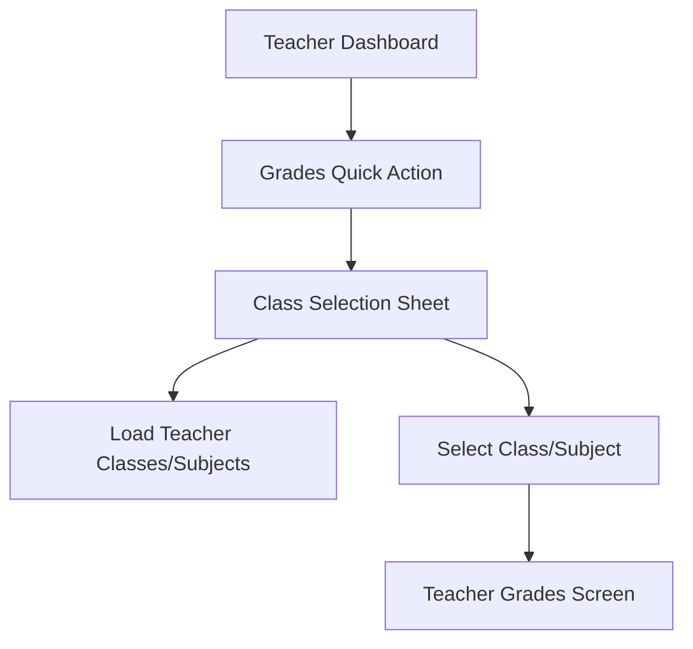
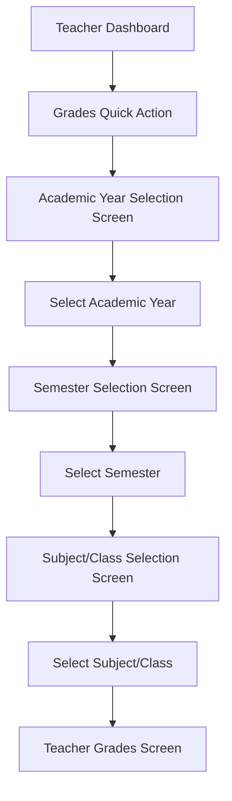

# Teacher Grade Navigation Flow

## Current Flow

## New Flow

## Implementation Steps

1. Create AcademicYearSelectionScreen
2. Create SemesterSelectionScreen
3. Modify Subject/Class Selection to filter by academic year/semester
4. Update TeacherDashboard to navigate to AcademicYearSelectionScreen instead of showing class selection sheet
5. Update navigation flow between all screens