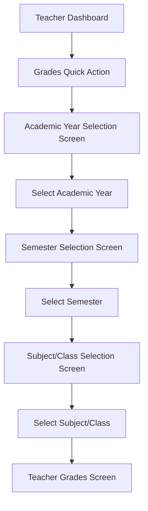

# Teacher Grade Page Redesign Summary

## Overview
This document summarizes the redesign of the teacher grade page to implement the following flow:
1. Teacher chooses academic year and semester
2. Then clicks on the subject which opens the class list
3. Teacher adds subject grade value for the student they choose
4. Click on save button and the data will be saved in the database

## Current Implementation Analysis
The current implementation has the following flow:
1. Teacher navigates to Grades screen (either through dashboard or classes screen)
2. The grades screen automatically loads semesters and students
3. Teacher can select semester and grade number directly on the grades screen

## Redesigned Implementation

### New Navigation Flow

### New Screens

#### 1. Academic Year Selection Screen
- Displays list of academic years for the teacher's school
- Shows academic year name, dates, and current status
- Navigates to Semester Selection Screen when an academic year is selected

#### 2. Semester Selection Screen
- Displays list of semesters for the selected academic year
- Shows semester name, number, dates, and current status
- Navigates to Classes Screen when a semester is selected

#### 3. Updated Classes Screen
- Displays classes/subjects filtered by selected academic year/semester
- Shows class name, subject name, and student count
- Navigates to Teacher Grades Screen when a class/subject is selected

#### 4. Updated Teacher Grades Screen
- Receives academic year and semester as parameters
- Does not show semester selection dropdown
- Loads grades using academic year/semester
- Displays selected academic year/semester in the UI

### Key Changes

#### Teacher Dashboard
- Updated Grades quick action to navigate to Academic Year Selection Screen
- Removed class selection sheet

#### Teacher Service
- Updated methods to support new functionality
- Added filtering by academic year/semester where needed

#### Data Flow
- Academic year and semester are selected first
- These selections are passed through the navigation flow
- Grades are saved with the selected academic year/semester

## Implementation Files

### New Files
1. `lib/screens/teacher/academic_year_selection_screen.dart`
2. `lib/screens/teacher/semester_selection_screen.dart`

### Updated Files
1. `lib/screens/teacher/classes_screen.dart`
2. `lib/screens/teacher/grades_screen.dart`
3. `lib/screens/teacher/teacher_dashboard.dart`
4. `lib/services/teacher_service.dart`

## Testing Plan
Comprehensive testing plan created covering:
- Academic Year Selection Screen
- Semester Selection Screen
- Updated Classes Screen
- Updated Teacher Grades Screen
- Navigation Flow
- Edge Cases

## Benefits of the Redesign
1. **Clearer Workflow**: Teachers explicitly select academic year and semester before entering grades
2. **Better Organization**: Data is organized by academic year/semester from the start
3. **Reduced Confusion**: No need to select semester on the grades screen since it's already selected
4. **Improved Data Integrity**: Grades are always associated with the correct academic year/semester
5. **Enhanced User Experience**: More intuitive flow that matches the requested workflow

## Implementation Status
- [x] Analyze current teacher grade page implementation
- [x] Design new academic year/semester selection screen
- [x] Modify teacher navigation flow to use new selection process
- [x] Update grades screen to work with new flow
- [x] Implement academic year selection functionality
- [x] Test the new flow

## Next Steps
The implementation plan is complete and ready for development. The next step would be to create the actual code files for the new screens and update the existing ones according to the design specifications.