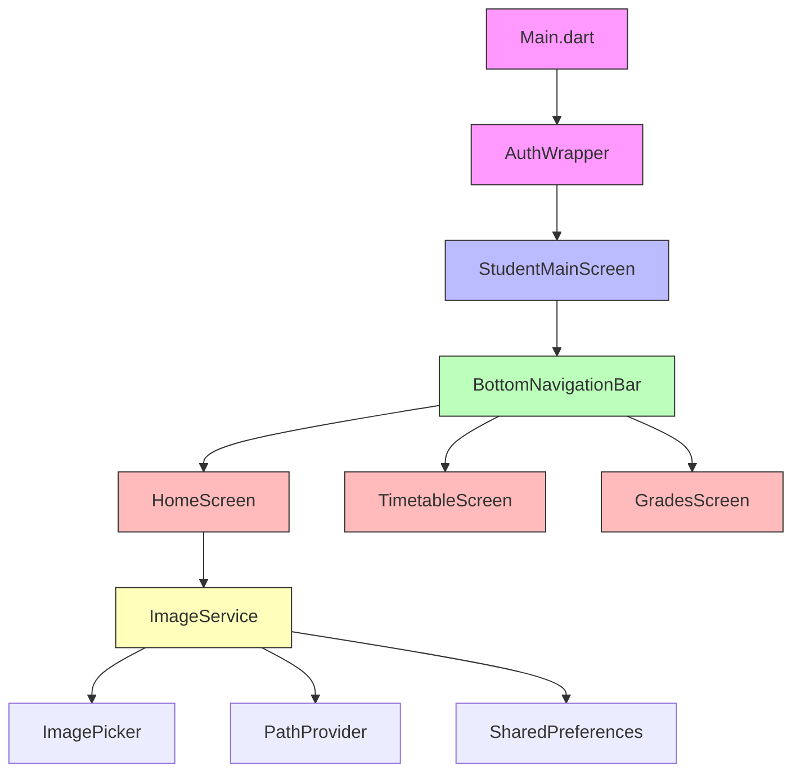
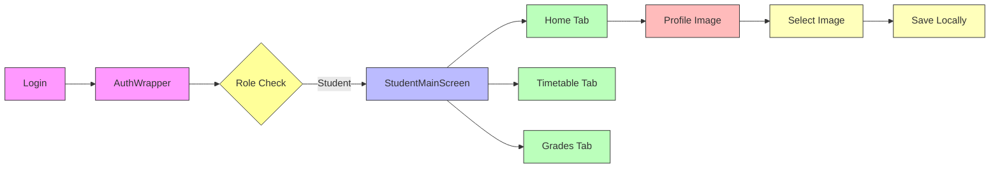

# Student Portal Architecture

## Component Diagram



## Navigation Flow



## Data Flow

```mermaid
sequenceDiagram
    participant User
    participant Main
    participant AuthWrapper
    participant StudentMain
    participant HomeScreen
    participant ImageService
    participant Storage
    
    User->>Main: App Launch
    Main->>AuthWrapper: Initialize
    AuthWrapper->>StudentMain: Authenticated Student
    StudentMain->>HomeScreen: Show Home Tab
    User->>HomeScreen: Tap Profile Picture
    HomeScreen->>ImageService: Request Image Selection
    ImageService->>Storage: Save Image Path
    Storage-->>ImageService: Return Success
    ImageService-->>HomeScreen: Update UI