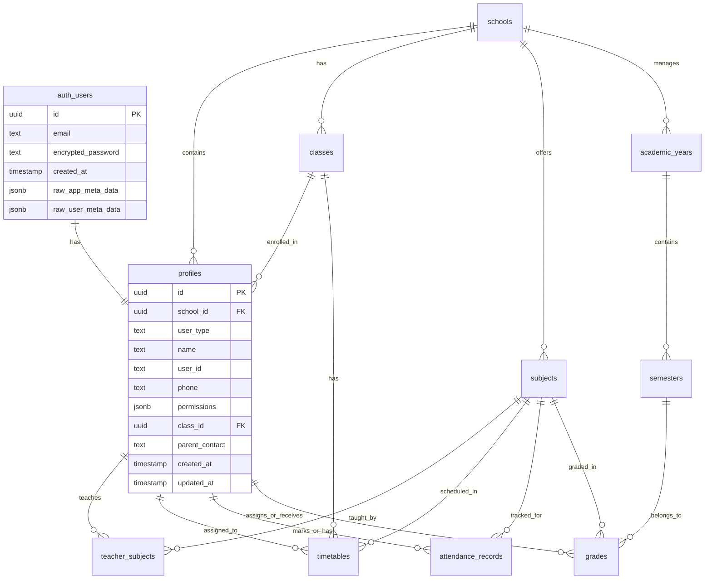

# Updated School Management System - Database Schema with Profiles

## Overview
This updated schema uses Supabase's built-in `auth.users` table for authentication and a single `profiles` table to store user data for all three user types (Admin, Teacher, Student).

## Updated Database Schema

### Core Tables

#### 1. Schools Table (unchanged)
```sql
CREATE TABLE schools (
    id UUID PRIMARY KEY DEFAULT gen_random_uuid(),
    name TEXT NOT NULL,
    address TEXT,
    phone TEXT,
    email TEXT,
    created_at TIMESTAMP WITH TIME ZONE DEFAULT NOW(),
    updated_at TIMESTAMP WITH TIME ZONE DEFAULT NOW()
);
```

#### 2. Profiles Table (replaces admins, teachers, students tables)
```sql
CREATE TABLE profiles (
    id UUID PRIMARY KEY REFERENCES auth.users(id) ON DELETE CASCADE,
    school_id UUID REFERENCES schools(id) ON DELETE CASCADE,
    user_type TEXT NOT NULL CHECK (user_type IN ('admin', 'teacher', 'student')),
    name TEXT NOT NULL,
    user_id TEXT UNIQUE NOT NULL, -- admin_id, teacher_id, or student_id
    phone TEXT,
    
    -- Admin specific fields
    permissions JSONB DEFAULT '{}',
    
    -- Student specific fields
    class_id UUID REFERENCES classes(id) ON DELETE SET NULL,
    parent_contact TEXT,
    
    -- Metadata
    created_at TIMESTAMP WITH TIME ZONE DEFAULT NOW(),
    updated_at TIMESTAMP WITH TIME ZONE DEFAULT NOW(),
    
    -- Constraints
    CONSTRAINT valid_admin_data CHECK (
        user_type != 'admin' OR (permissions IS NOT NULL)
    ),
    CONSTRAINT valid_student_data CHECK (
        user_type != 'student' OR (class_id IS NOT NULL AND parent_contact IS NOT NULL)
    )
);
```

#### 3. Classes Table (unchanged)
```sql
CREATE TABLE classes (
    id UUID PRIMARY KEY DEFAULT gen_random_uuid(),
    school_id UUID REFERENCES schools(id) ON DELETE CASCADE,
    name TEXT NOT NULL,
    grade_level TEXT,
    capacity INTEGER DEFAULT 30,
    created_at TIMESTAMP WITH TIME ZONE DEFAULT NOW(),
    updated_at TIMESTAMP WITH TIME ZONE DEFAULT NOW()
);
```

#### 4. Subjects Table (unchanged)
```sql
CREATE TABLE subjects (
    id UUID PRIMARY KEY DEFAULT gen_random_uuid(),
    school_id UUID REFERENCES schools(id) ON DELETE CASCADE,
    name TEXT NOT NULL,
    code TEXT NOT NULL,
    description TEXT,
    created_at TIMESTAMP WITH TIME ZONE DEFAULT NOW(),
    updated_at TIMESTAMP WITH TIME ZONE DEFAULT NOW(),
    UNIQUE(school_id, code)
);
```

#### 5. Teacher Subjects Junction Table (updated to use profiles)
```sql
CREATE TABLE teacher_subjects (
    id UUID PRIMARY KEY DEFAULT gen_random_uuid(),
    teacher_id UUID REFERENCES profiles(id) ON DELETE CASCADE,
    subject_id UUID REFERENCES subjects(id) ON DELETE CASCADE,
    created_at TIMESTAMP WITH TIME ZONE DEFAULT NOW(),
    UNIQUE(teacher_id, subject_id),
    
    -- Ensure only teachers can be assigned to subjects
    CONSTRAINT teacher_subjects_check CHECK (
        EXISTS (
            SELECT 1 FROM profiles 
            WHERE id = teacher_id AND user_type = 'teacher'
        )
    )
);
```

#### 6. Academic Years Table (unchanged)
```sql
CREATE TABLE academic_years (
    id UUID PRIMARY KEY DEFAULT gen_random_uuid(),
    school_id UUID REFERENCES schools(id) ON DELETE CASCADE,
    name TEXT NOT NULL,
    start_date DATE NOT NULL,
    end_date DATE NOT NULL,
    is_current BOOLEAN DEFAULT FALSE,
    created_at TIMESTAMP WITH TIME ZONE DEFAULT NOW(),
    UNIQUE(school_id, name)
);
```

#### 7. Semesters Table (unchanged)
```sql
CREATE TABLE semesters (
    id UUID PRIMARY KEY DEFAULT gen_random_uuid(),
    academic_year_id UUID REFERENCES academic_years(id) ON DELETE CASCADE,
    name TEXT NOT NULL,
    semester_number INTEGER NOT NULL CHECK (semester_number IN (1, 2, 3)),
    start_date DATE NOT NULL,
    end_date DATE NOT NULL,
    is_current BOOLEAN DEFAULT FALSE,
    created_at TIMESTAMP WITH TIME ZONE DEFAULT NOW(),
    UNIQUE(academic_year_id, semester_number)
);
```

#### 8. Timetables Table (updated to use profiles)
```sql
CREATE TABLE timetables (
    id UUID PRIMARY KEY DEFAULT gen_random_uuid(),
    school_id UUID REFERENCES schools(id) ON DELETE CASCADE,
    class_id UUID REFERENCES classes(id) ON DELETE CASCADE,
    subject_id UUID REFERENCES subjects(id) ON DELETE CASCADE,
    teacher_id UUID REFERENCES profiles(id) ON DELETE CASCADE,
    day_of_week TEXT NOT NULL CHECK (day_of_week IN ('monday', 'tuesday', 'wednesday', 'thursday', 'friday', 'saturday', 'sunday')),
    start_time TIME NOT NULL,
    end_time TIME NOT NULL,
    created_at TIMESTAMP WITH TIME ZONE DEFAULT NOW(),
    updated_at TIMESTAMP WITH TIME ZONE DEFAULT NOW(),
    UNIQUE(class_id, day_of_week, start_time),
    
    -- Ensure only teachers can be assigned to timetables
    CONSTRAINT timetable_teacher_check CHECK (
        EXISTS (
            SELECT 1 FROM profiles 
            WHERE id = teacher_id AND user_type = 'teacher'
        )
    )
);
```

#### 9. Attendance Records Table (updated to use profiles)
```sql
CREATE TABLE attendance_records (
    id UUID PRIMARY KEY DEFAULT gen_random_uuid(),
    student_id UUID REFERENCES profiles(id) ON DELETE CASCADE,
    subject_id UUID REFERENCES subjects(id) ON DELETE CASCADE,
    teacher_id UUID REFERENCES profiles(id) ON DELETE CASCADE,
    attendance_date DATE NOT NULL,
    is_present BOOLEAN NOT NULL DEFAULT TRUE,
    notes TEXT,
    created_at TIMESTAMP WITH TIME ZONE DEFAULT NOW(),
    UNIQUE(student_id, subject_id, attendance_date),
    
    -- Ensure student_id references a student and teacher_id references a teacher
    CONSTRAINT attendance_student_check CHECK (
        EXISTS (
            SELECT 1 FROM profiles 
            WHERE id = student_id AND user_type = 'student'
        )
    ),
    CONSTRAINT attendance_teacher_check CHECK (
        EXISTS (
            SELECT 1 FROM profiles 
            WHERE id = teacher_id AND user_type = 'teacher'
        )
    )
);
```

#### 10. Grades Table (updated to use profiles)
```sql
CREATE TABLE grades (
    id UUID PRIMARY KEY DEFAULT gen_random_uuid(),
    student_id UUID REFERENCES profiles(id) ON DELETE CASCADE,
    subject_id UUID REFERENCES subjects(id) ON DELETE CASCADE,
    teacher_id UUID REFERENCES profiles(id) ON DELETE CASCADE,
    semester_id UUID REFERENCES semesters(id) ON DELETE CASCADE,
    grade_number INTEGER NOT NULL CHECK (grade_number IN (1, 2)),
    grade_value DECIMAL(5,2) NOT NULL,
    max_grade DECIMAL(5,2) NOT NULL DEFAULT 100.00,
    notes TEXT,
    created_at TIMESTAMP WITH TIME ZONE DEFAULT NOW(),
    updated_at TIMESTAMP WITH TIME ZONE DEFAULT NOW(),
    UNIQUE(student_id, subject_id, semester_id, grade_number),
    
    -- Ensure student_id references a student and teacher_id references a teacher
    CONSTRAINT grades_student_check CHECK (
        EXISTS (
            SELECT 1 FROM profiles 
            WHERE id = student_id AND user_type = 'student'
        )
    ),
    CONSTRAINT grades_teacher_check CHECK (
        EXISTS (
            SELECT 1 FROM profiles 
            WHERE id = teacher_id AND user_type = 'teacher'
        )
    )
);
```

## Updated Entity Relationships



## Updated Functions

### Profile Management Functions

```sql
-- Function to create a new user profile
CREATE OR REPLACE FUNCTION create_user_profile(
    p_user_id UUID,
    p_school_id UUID,
    p_user_type TEXT,
    p_name TEXT,
    p_user_identifier TEXT, -- admin_id, teacher_id, or student_id
    p_phone TEXT DEFAULT NULL,
    p_permissions JSONB DEFAULT '{}',
    p_class_id UUID DEFAULT NULL,
    p_parent_contact TEXT DEFAULT NULL
)
RETURNS UUID
LANGUAGE plpgsql
SECURITY DEFINER
AS $$
BEGIN
    -- Validate user_type
    IF p_user_type NOT IN ('admin', 'teacher', 'student') THEN
        RAISE EXCEPTION 'Invalid user_type. Must be admin, teacher, or student';
    END IF;
    
    -- Validate required fields based on user_type
    IF p_user_type = 'student' AND (p_class_id IS NULL OR p_parent_contact IS NULL) THEN
        RAISE EXCEPTION 'Students must have class_id and parent_contact';
    END IF;
    
    INSERT INTO profiles (
        id, school_id, user_type, name, user_id, phone,
        permissions, class_id, parent_contact
    )
    VALUES (
        p_user_id, p_school_id, p_user_type, p_name, p_user_identifier, p_phone,
        CASE WHEN p_user_type = 'admin' THEN p_permissions ELSE NULL END,
        CASE WHEN p_user_type = 'student' THEN p_class_id ELSE NULL END,
        CASE WHEN p_user_type = 'student' THEN p_parent_contact ELSE NULL END
    );
    
    RETURN p_user_id;
END;
$$;

-- Function to get user profile with role
CREATE OR REPLACE FUNCTION get_user_profile(p_user_id UUID)
RETURNS TABLE(
    id UUID,
    school_id UUID,
    user_type TEXT,
    name TEXT,
    user_id TEXT,
    phone TEXT,
    permissions JSONB,
    class_id UUID,
    parent_contact TEXT,
    school_name TEXT,
    class_name TEXT
)
LANGUAGE plpgsql
SECURITY DEFINER
AS $$
BEGIN
    RETURN QUERY
    SELECT 
        p.id,
        p.school_id,
        p.user_type,
        p.name,
        p.user_id,
        p.phone,
        p.permissions,
        p.class_id,
        p.parent_contact,
        s.name as school_name,
        c.name as class_name
    FROM profiles p
    JOIN schools s ON p.school_id = s.id
    LEFT JOIN classes c ON p.class_id = c.id
    WHERE p.id = p_user_id;
END;
$$;

-- Function to get all users by type and school
CREATE OR REPLACE FUNCTION get_users_by_type(
    p_school_id UUID,
    p_user_type TEXT,
    p_limit INTEGER DEFAULT NULL,
    p_offset INTEGER DEFAULT NULL
)
RETURNS TABLE(
    id UUID,
    name TEXT,
    user_id TEXT,
    phone TEXT,
    email TEXT,
    class_name TEXT,
    created_at TIMESTAMP WITH TIME ZONE
)
LANGUAGE plpgsql
SECURITY DEFINER
AS $$
BEGIN
    RETURN QUERY
    SELECT 
        p.id,
        p.name,
        p.user_id,
        p.phone,
        au.email,
        c.name as class_name,
        p.created_at
    FROM profiles p
    JOIN auth.users au ON p.id = au.id
    LEFT JOIN classes c ON p.class_id = c.id
    WHERE p.school_id = p_school_id 
    AND p.user_type = p_user_type
    ORDER BY p.name
    LIMIT p_limit
    OFFSET p_offset;
END;
$$;
```

## Updated RLS Policies

### Helper Functions (updated)
```sql
-- Function to get current user's school_id
CREATE OR REPLACE FUNCTION get_user_school_id()
RETURNS UUID
LANGUAGE plpgsql
SECURITY DEFINER
AS $$
DECLARE
    user_school_id UUID;
BEGIN
    SELECT school_id INTO user_school_id
    FROM profiles
    WHERE id = auth.uid();
    
    RETURN user_school_id;
END;
$$;

-- Function to get user role
CREATE OR REPLACE FUNCTION get_user_role()
RETURNS TEXT
LANGUAGE plpgsql
SECURITY DEFINER
AS $$
DECLARE
    user_role TEXT;
BEGIN
    SELECT user_type INTO user_role
    FROM profiles
    WHERE id = auth.uid();
    
    RETURN COALESCE(user_role, 'none');
END;
$$;
```

### RLS Policies for Profiles Table
```sql
-- Enable RLS on profiles table
ALTER TABLE profiles ENABLE ROW LEVEL SECURITY;

-- Users can view their own profile
CREATE POLICY "Users can view own profile" ON profiles
    FOR SELECT USING (id = auth.uid());

-- Users can update their own profile (limited fields)
CREATE POLICY "Users can update own profile" ON profiles
    FOR UPDATE USING (id = auth.uid())
    WITH CHECK (id = auth.uid());

-- Admins can view all profiles in their school
CREATE POLICY "Admins can view school profiles" ON profiles
    FOR SELECT USING (
        school_id = get_user_school_id() AND 
        get_user_role() = 'admin'
    );

-- Admins can create profiles in their school
CREATE POLICY "Admins can create profiles" ON profiles
    FOR INSERT WITH CHECK (
        school_id = get_user_school_id() AND 
        get_user_role() = 'admin'
    );

-- Admins can update profiles in their school
CREATE POLICY "Admins can update school profiles" ON profiles
    FOR UPDATE USING (
        school_id = get_user_school_id() AND 
        get_user_role() = 'admin'
    );

-- Teachers can view other teachers and students in their school
CREATE POLICY "Teachers can view school users" ON profiles
    FOR SELECT USING (
        school_id = get_user_school_id() AND 
        get_user_role() = 'teacher' AND
        user_type IN ('teacher', 'student')
    );
```

## Profile Creation Trigger

```sql
-- Function to handle new user signup and create profile
CREATE OR REPLACE FUNCTION public.handle_new_user()
RETURNS TRIGGER AS $$
BEGIN
    -- The profile will be created separately by the admin
    -- This trigger just ensures the user exists in auth.users
    RETURN NEW;
END;
$$ LANGUAGE plpgsql SECURITY DEFINER;

-- Create trigger for new user signup
CREATE TRIGGER on_auth_user_created
    AFTER INSERT ON auth.users
    FOR EACH ROW EXECUTE FUNCTION public.handle_new_user();
```

## Key Benefits of This Approach

1. **Leverages Supabase Auth**: Uses the built-in authentication system
2. **Single Profile Table**: Cleaner design with one table for all user types
3. **Type Safety**: Constraints ensure data integrity based on user_type
4. **Flexible**: Easy to add new user types or fields
5. **Secure**: RLS policies work with Supabase's auth.uid()

## Migration Strategy

If you already have separate tables, you can migrate using:

```sql
-- Example migration from separate tables to profiles
INSERT INTO profiles (id, school_id, user_type, name, user_id, phone, permissions)
SELECT 
    gen_random_uuid(), -- or map to existing auth.users.id
    school_id,
    'admin',
    name,
    admin_id,
    phone,
    permissions
FROM admins;

-- Similar for teachers and students...
```

This updated schema is much cleaner and follows Supabase best practices!